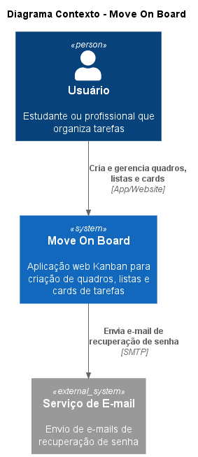
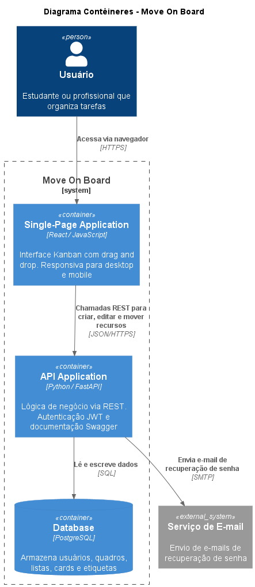
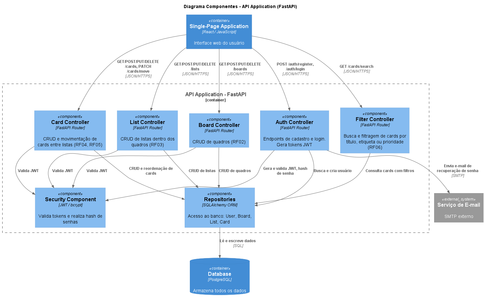

Alunos: Henrique Xavier Klappoth e Rodrigo Xavier Klappoth
Professor: Luiz Carlos Camargo
Curso: Engenharia de Software 5a fase
Universidade: Católica de Santa Catarina

Protótipo do front: https://www.figma.com/make/ytEycGcZPl0j2kLYCvYLLh/Move-on-Board

# 📌 1. Domínio do Problema

## 🎯 Visão Geral

O **Move On Board** é uma aplicação web para organização de tarefas baseada no modelo Kanban, permitindo que usuários criem quadros, listas e cartões para acompanhar o progresso de atividades.

O sistema é voltado para estudantes, pequenos times e usuários individuais que desejam organizar tarefas de forma visual, simples e eficiente.

---

## ❗ Problema a Ser Resolvido

Muitas pessoas organizam tarefas utilizando:

* Bloco de notas
* Papel
* Conversas em WhatsApp
* Planilhas desorganizadas

Isso gera:

* Falta de controle de progresso
* Dificuldade de priorização
* Perda de tarefas
* Baixa visibilidade do fluxo de trabalho

O **Move On Board** resolve esse problema através de um sistema visual baseado em quadros e cartões.

---

## 🧩 Conceitos do Domínio

### 👤 Usuário

Pessoa autenticada no sistema.

### 📋 Quadro (Board)

Espaço de organização de tarefas (ex: "Faculdade", "Trabalho", "Projeto X").

### 📑 Lista (Column)

Colunas dentro do quadro (ex: "A Fazer", "Em Progresso", "Concluído").

### 📝 Card (Task)

Tarefa individual dentro de uma lista.

### 🏷️ Etiqueta (Label)

Marcadores visuais para classificação (ex: "Urgente", "Bug", "Estudo").

---

# 📌 2. Requisitos do Sistema

## ✅ Requisitos Funcionais (RF)

**RF01 — Autenticação**

* Cadastro de usuário
* Login e Logout
* Autenticação via JWT

**RF02 — Gestão de Quadros**

* Criar quadro
* Listar quadros
* Editar quadro
* Excluir quadro

**RF03 — Gestão de Listas**

* Criar listas dentro de um quadro
* Editar nome da lista
* Excluir lista

**RF04 — Gestão de Cards**

* Criar card
* Editar card
* Excluir card
* Definir descrição, prioridade e prazo

**RF05 — Movimentação de Cards**

* Mover cards entre listas (drag and drop)
* Reordenar cards dentro da lista
* Persistir nova posição no banco

**RF06 — Filtros**

* Buscar cards por título
* Filtrar por etiqueta ou prioridade

**RF07 — Membros do Quadro**

* Convidar membros ao quadro por e-mail (somente o dono)
* Listar membros do quadro
* Remover membros do quadro

**RF08 — Atribuição de Tarefas**

* Atribuir um responsável a uma tarefa
* Responsável deve ser membro do quadro
* Exibir avatar do responsável no card

---

## ⚙️ Requisitos Não Funcionais (RNF)

**RNF01 — Segurança**

* Senhas armazenadas com hash (bcrypt/argon2)
* Autenticação via JWT

**RNF02 — Performance**

* Operações de listagem devem responder em tempo adequado

**RNF03 — Usabilidade**

* Interface intuitiva
* Sistema responsivo (desktop e mobile)

**RNF04 — Manutenibilidade**

* Separação clara entre camadas (Controller, Service, Repository)
* Código organizado e padronizado

**RNF05 — Confiabilidade**

* Operações críticas devem usar transações no banco
* Garantia de integridade dos dados

---

# 📌 3. Tecnologias Utilizadas e Justificativas

## 🐍 Back-end — Python

### Framework: FastAPI

**Justificativa:**

* Alta produtividade
* Documentação automática (Swagger)
* Validação de dados com Pydantic
* Excelente desempenho

Permite criar uma API REST organizada e escalável.

---

## ⚛️ Front-end — React

**Justificativa:**

* Componentização
* Facilidade para criar interfaces dinâmicas
* Ideal para sistemas com drag and drop
* Grande ecossistema de bibliotecas

Bibliotecas recomendadas:

* React Router (roteamento)
* Mantine para componentes
* Axios (requisições HTTP)

---

## 🐘 Banco de Dados — PostgreSQL

**Justificativa:**

* Banco relacional robusto
* Suporte a integridade referencial
* Excelente desempenho
* Amplamente utilizado no mercado

Ideal para modelagem de:

* Usuário → Quadro → Lista → Card

---

# 📌 4. Arquitetura Geral

A arquitetura do sistema foi documentada seguindo o modelo **C4** (Context → Container → Component), com diagramas gerados via PlantUML.

* API REST
* Separação Front-end e Back-end
* Banco relacional com integridade referencial
* Autenticação stateless com JWT

## Nível 1 — Contexto

Mostra o sistema como um todo e como o usuário interage com ele.

> Fonte: [`docs/c4/c4_nivel1_contexto.puml`](docs/c4/c4_nivel1_contexto.puml)

## Nível 2 — Containers

Detalha os containers do sistema: Frontend (React SPA), API (FastAPI) e Banco de Dados (PostgreSQL).

> Fonte: [`docs/c4/c4_nivel2_containers.puml`](docs/c4/c4_nivel2_containers.puml)

## Nível 3 — Componentes

Expande o container da API, mostrando os controllers, serviços, repositórios e o módulo de segurança JWT/bcrypt.

> Fonte: [`docs/c4/c4_nivel3_componentes.puml`](docs/c4/c4_nivel3_componentes.puml)

---

# 📌 5. Escopo Inicial (MVP)

✔ Cadastro/Login

✔ CRUD de Quadros

✔ CRUD de Listas

✔ CRUD de Cards

✔ Movimentação de Cards (drag & drop + reordenar listas)

✔ Filtro básico

✔ Membros do Quadro (convidar, listar, remover)

✔ Atribuição de Tarefas (responsável por card)
